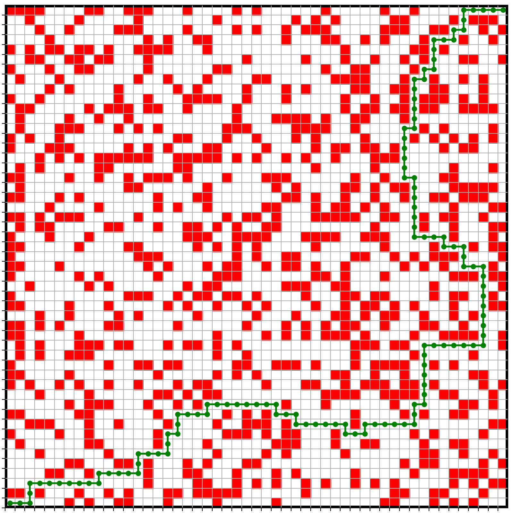

# MinPath: calculate shortest path between start and finish nodes of a graph.

Given a graph the code calculates the minimal distance path between start and finish nodes.
The graph nodes have no particular geometry, but convenience helpers are provided for generating
graphs with nodes that can be associated with a rectangular grid with obstacles.

Obstacles and visualization python tool is also provided.

# Download

```
git clone https://github.com/bslew/shortest_path.git	
```

# Compile

```
cd shortest_path
mkdir build
cd build && cmake ..
make
```

## Usage Examples
### Generate obstacles
```
cd ../examples
```
First prepare `input.par` input parameter file where rectangular field configuration and other parameters are specified:

```
field_xmin=0
field_ymin=0
field_xmax=50
field_ymax=50
field_diag_connections=false
algo=MinimalDistance
# start point 
x=0
y=0
# destination point
xf=50
yf=50
# obstacles file
obst=obstacles.txt
# dump generated graph information to file
dg=input_graph
# dump shortest path information to file for plotting
dsp=shortest_path
```

### Generating file with randomly generated obstacles 
Generate file with obstacles. Specify number of obstacles to generate in the rectangular field. 
```
python3 ../python/shortest_path.py --genObstacles --obstacleCount 1000 -o obstacles.txt -c input.par
```
Information about the field size is read from the provided config file.

### Calculate shortest path
```
../build/src/shortest_path -c input.par
```
Obstacles are generated randomly.
If the generated obstacles prohibit traversal from starting node to the finish node the program
will issue error that the destination node cannot be reached. In such case another run for generating
obstacles may be needed, with possibly smaller number of obstacles.

### Plot shortest path
Visualize the graph, obstacles and the shortest path from the 
start point to destination point.
```
python3 ../python/shortest_path.py --plot shortest_path.coords --obstacles obstacles.txt -c input.par -o shortest_path.png
```



## Authors
Bartosz Lew [bartosz.lew@protonmail.com]
